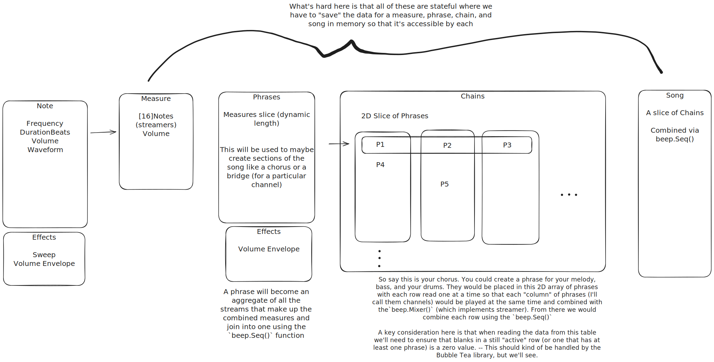

# chipboy

Terminal-based chiptune composer inspired by Little Sound DJ (LSDJ)

## Rewrite: 

I want to re-write my initial implementation from python to Go. To do this I'll be using the [`beep`](https://github.com/gopxl/beep?tab=readme-ov-file) go library for playback and audio processing. `Beep` uses another library, [`Oto`](https://github.com/ebitengine/oto), under the hood and requires the prerequisites listed at the bottom of this page. 

Additionally, I want to rewrite the TUI using Charm's [`BubbleTea`](https://github.com/charmbracelet/bubbletea) and [`Lip Gloss`](https://github.com/charmbracelet/lipgloss) libraries.


### Prerequisites

On some platforms you will need a C/C++ compiler in your path that Go can use.

* iOS: On newer macOS versions type clang on your terminal and a dialog with installation instructions will appear if you don't have it
    * If you get an error with clang use xcode instead xcode-select --install
* Linux and other Unix systems: Should be installed by default, but if not try GCC or Clang

#### macOS

Oto requires `AudioToolbox.framework`, but this is automatically linked.

#### iOS

Oto requires these frameworks:

* AVFoundation.framework
* AudioToolbox.framework

Add them to "Linked Frameworks and Libraries" on your Xcode project.

#### Linux

ALSA is required. On Ubuntu or Debian, run this command:

``` 
apt install libasound2-dev
```

On RedHat-based linux distributions, run:

```
dnf install alsa-lib-devel
```

In most cases this command must be run by root user or through sudo command.

#### FreeBSD, OpenBSD

BSD systems are not tested well. If ALSA works, Oto should work.





